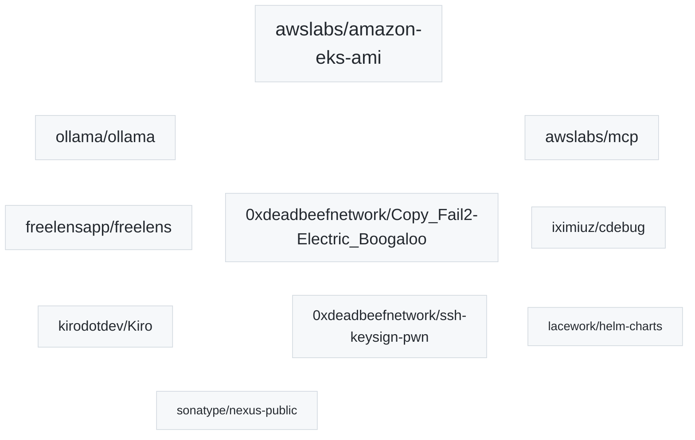

_This list updates automatically from my GitHub activity._

<!--START_SECTION:participated-projects-->

Issue links:
- `awslabs/amazon-eks-ami`: [#2713](https://github.com/awslabs/amazon-eks-ami/issues/2713), [#2267](https://github.com/awslabs/amazon-eks-ami/issues/2267), [#1364](https://github.com/awslabs/amazon-eks-ami/issues/1364)
- `ollama/ollama`: [#12660](https://github.com/ollama/ollama/issues/12660), [#12640](https://github.com/ollama/ollama/issues/12640), [#11714](https://github.com/ollama/ollama/issues/11714), [#5245](https://github.com/ollama/ollama/issues/5245)
- `freelensapp/freelens`: [#1839](https://github.com/freelensapp/freelens/issues/1839), [#1251](https://github.com/freelensapp/freelens/issues/1251), [#883](https://github.com/freelensapp/freelens/issues/883)
- `awslabs/mcp`: [#1109](https://github.com/awslabs/mcp/issues/1109), [#1083](https://github.com/awslabs/mcp/issues/1083), [#993](https://github.com/awslabs/mcp/issues/993), [#874](https://github.com/awslabs/mcp/issues/874)
- `0xdeadbeefnetwork/Copy_Fail2-Electric_Boogaloo`: [#8](https://github.com/0xdeadbeefnetwork/Copy_Fail2-Electric_Boogaloo/issues/8)
- `kirodotdev/Kiro`: [#5068](https://github.com/kirodotdev/Kiro/issues/5068), [#3910](https://github.com/kirodotdev/Kiro/issues/3910), [#3904](https://github.com/kirodotdev/Kiro/issues/3904)
- `iximiuz/cdebug`: [#7](https://github.com/iximiuz/cdebug/issues/7), [#6](https://github.com/iximiuz/cdebug/issues/6), [#1](https://github.com/iximiuz/cdebug/issues/1)
- `0xdeadbeefnetwork/ssh-keysign-pwn`: [#1](https://github.com/0xdeadbeefnetwork/ssh-keysign-pwn/issues/1)
- `sonatype/nexus-public`: [#832](https://github.com/sonatype/nexus-public/issues/832), [#419](https://github.com/sonatype/nexus-public/issues/419)
- `lacework/helm-charts`: [#260](https://github.com/lacework/helm-charts/issues/260), [#233](https://github.com/lacework/helm-charts/issues/233)
<!--END_SECTION:participated-projects-->
