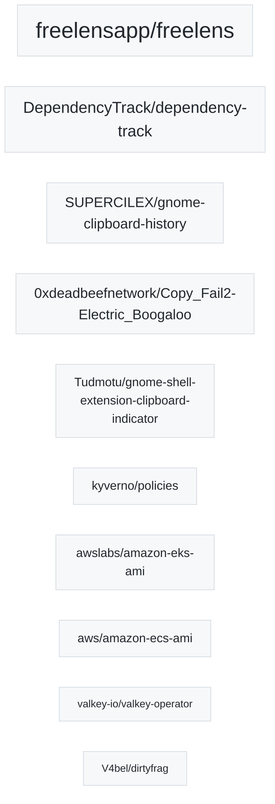

_This list updates automatically from my GitHub activity._

<!--START_SECTION:participated-projects-->

```mermaid
graph LR
  classDef tag fill:#f6f8fa,stroke:#d0d7de,color:#24292f;
  p1["freelensapp/freelens"]:::tag
  style p1 font-size:36px
  p2["DependencyTrack/dependency-track"]:::tag
  style p2 font-size:26px
  p3["SUPERCILEX/gnome-clipboard-history"]:::tag
  style p3 font-size:23px
  p4["0xdeadbeefnetwork/Copy_Fail2-Electric_Boogaloo"]:::tag
  style p4 font-size:23px
  p5["Tudmotu/gnome-shell-extension-clipboard-indicator"]:::tag
  style p5 font-size:20px
  p6["kyverno/policies"]:::tag
  style p6 font-size:20px
  p7["awslabs/amazon-eks-ami"]:::tag
  style p7 font-size:20px
  p8["aws/amazon-ecs-ami"]:::tag
  style p8 font-size:20px
  p9["valkey-io/valkey-operator"]:::tag
  style p9 font-size:17px
  p10["V4bel/dirtyfrag"]:::tag
  style p10 font-size:17px
```
<!--END_SECTION:participated-projects-->
